autoscale: true
theme: Next, 3
code: Hack
slidenumbers: true

[.header: alignment(center)]
# [fit] Spying on your Code

# [fit] Instrumentation in Node.js

---

[.autoscale: true]

[.header: alignment(center)]
# Hi everyone!

### I'm Ehden

[.list: bullet-character(  )]
- node agent engineer, Contrast Security
- 
- [github.com/cixel](https://github.com/cixel)
- [ehden@contrastsecurity.com](mailto:ehden@contrastsecurity.com)
- 

^ This is me, my name is Ehden

^ I work on the node agent at Contrast Security.
we're an application security startup based out of Baltimore

^ We write software that sits inside running web apps and makes them report their own security problems at runtime

^ I'm joined today by [the contrast people]
They don't go here, they're here to make this even more uncomfortable for me

^ Arshan, who is one of the cofounders.
He's the one who put me up to this, so if you hate this, blame him

---

[.autoscale: true]

[.header: alignment(center)]
# Hi everyone!

### I'm Ehden

[.list: bullet-character(  )]
- node agent engineer, Contrast Security
- Towson alum!
- [github.com/cixel](https://github.com/gilday)
- [ehden@contrastsecurity.com](mailto:ehden@contrastsecurity.com)
- 

^ Most of us here are Towson alum

^ happy to be back

^ grateful for the opportunity to speak, stay connected to the department and the students

^ we'll probably hang around a bit after the talk

^ come talk to us, ask questions, etc., we want to meet all you

^ that's why we're here, that's why i'm doing this

---

# Instrumentation in Node.js

^ ##  📏🔬📐 

^ So the subject of the talk is Instrumentation in node

^ So I'm gonna start by laying out a couple of basic definitions

---


# JavaScipt. On the server.

^ First is Node.js. If you don't know what it is, there's a good chance you've at least seen it.

^ It's JavaScript, but not in the browser

^ Now JavaScript is based on a spec, called ECMAScript

---

```javascript
document.getElementByID('snippet')
```

^ Things we typically associate with JavaScript like ability to interact with elements in HTML

^ Not actually part of that spec

^ Belong to a different spec, called the DOM spec

^ They usually aren't even implemented in JS

^ C++ or whatever language the browser is written in

---


^ So what Node did is it took Chrome's JavaScript engine

^ On top of it, instead of putting a bunch of browser APIs, they put in a bunch of other APIs, to help you do things like talk to the filesystem

^ spawning child processes, opening socket connections. Y'know, classic OS and back-end stuff.

---


[.autoscale: true]

- Assertion Testing
- Async Hooks
- Buffer
- C++ Addons
- C/C++ Addons - N-API
- Child Processes
- Cluster
- Command Line Options
- Console
- Crypto
- Debugger
- Deprecated APIs
- DNS
- Domain
- ECMAScript Modules
- Errors
- Events
- File System
- Globals
- HTTP
- HTTP/2
- HTTPS
- Inspector
- Internationalization
- Modules
- Net
- OS
- Path
- Performance Hooks
- Process
- ...

^ And out of the box, it gives quite a bit of these APIs

^ For just about whatever

^ But not all at once, all the time

^ And so to help you manage these, it also introduced a module system, to keep organize these, and a way to import things, to help you bring just the things you actually need into your code, the way you would in Python or Java

^ OPTIONAL: In browser, different libraries, when loaded, are pretty just stacked on top of one another globally
So node does this a bit more neatly

---

[.code-highlight: all]
[.code-highlight: 2]
[.code-highlight: 3]
[.code-highlight: 5-8]
[.code-highlight: 6-7]
[.code-highlight: 10-12]

```javascript
// demo.js
const express = require('express');
const app = express();

app.get('/hi', function(req, res) {
  const name = req.query.name;
  res.send('hello, ' + encodeURIComponent(name));
});

app.listen(3000, function() {
	console.log('Example app listening on port 3000!');
});
```

^ this is what a simple, barebones web app looks like in nodejs
[BUILD]

^ first thing we do is use that import system i mentioned to pull in a nifty http framework library called express
[BUILD]

^ then we call that thing we just loaded, and it returns an http listener we call app
[BUILD]

^ then we register a handler for slash hi
[BUILD]

^ which pulls a field called name out of the query string and sends back hello, name as a response
[BUILD]

^ then we tell the server to start listening on port 3000

---

```bash
$ node demo.js
Example app listening on port 3000!
```

^ you run it like this

---

```bash
$ node demo.js
Example app listening on port 3000!
```

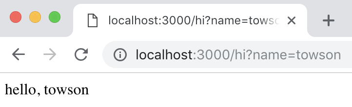

^ and this is what that ends up looking like if you set name to towson

---

# Instrumentation in
# ✅ Node.js

^ Ok so that's Node.js

---

# *Instrumentation* in
# ✅ Node.js

^ Time to start talking about instrumentation

^ First, what the heck is it


---

# 🎷🎸🎻🥁🎺

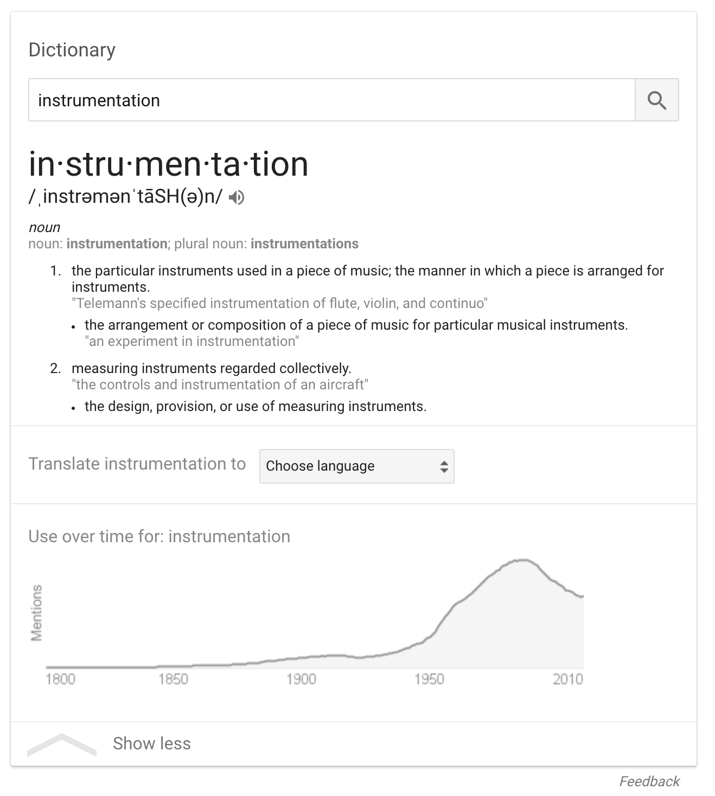

^ If you look up the definition in google, it's got a couple

---

# 📏🔬📐

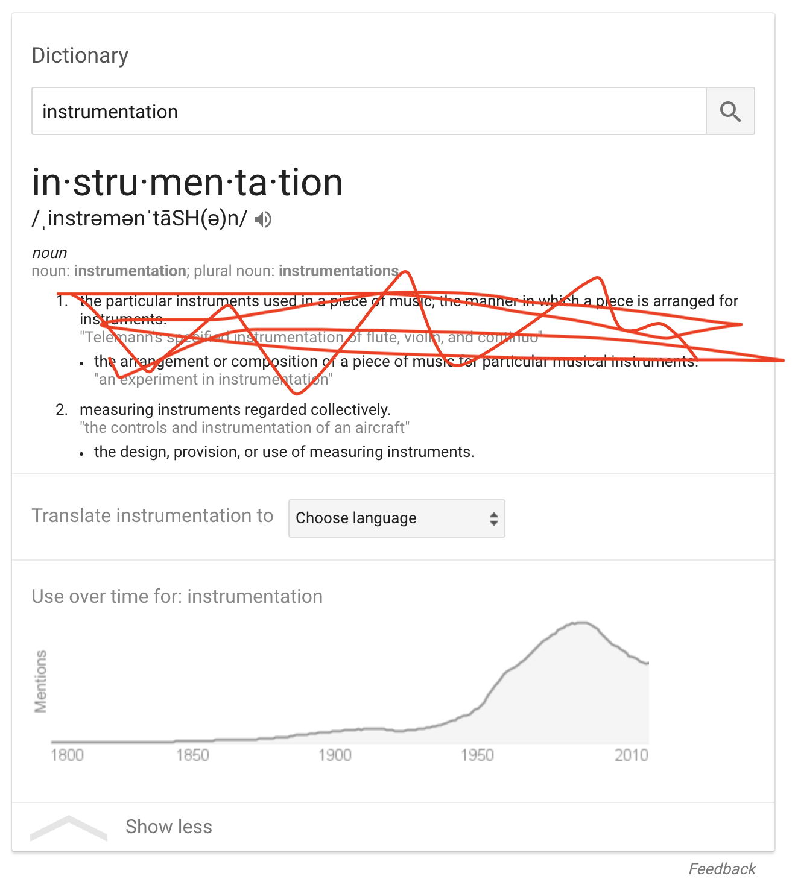

^ The 2nd is the one we're after here

^ [take a moment, read it off]

^ measuring instruments regarded collectively

^ now that's a definition that uses most of the word we're trying to define in the definition

^ so let's look that up

---

# 📏

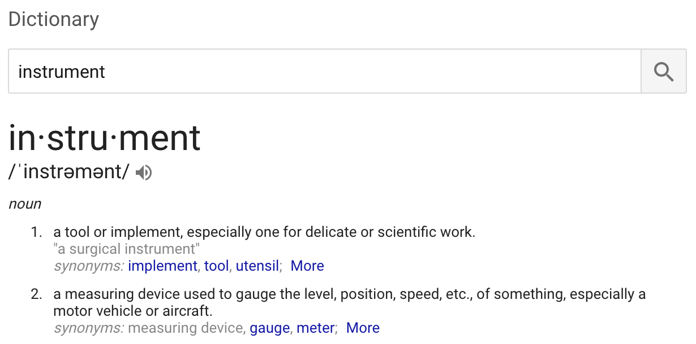

^ that's better

^ so it's *stuff* to measure what a *thing* is doing

^ Now instrumentation is everywhere in other engineering disciplines

^ Manufacturing plants will have sensors at basically every point along the factory line

^ Nobody makes cars anymore that don't have very sophisticated diagnostic instruments everywhere

^ Software engineering is still sort of lagging behind, in my opinion

^ But that's changing

---

## Instrumentation

Used for...

- logging
- performance monitoring
- debugging

^ Today in software, it's used for a wide variety of things

^ Originally used mostly for adding logging

^ Now used for things like performance monitoring

^ can be used to find certain issues that can crop up at runtime, such as bad memory use or race conditions

---

## Instrumentation

Used for...

- logging
- performance monitoring
- debugging

^ At Contrast, we use instrumentation to find vulnerabilities in web applications

^ To explain that, I'm gonna steal an analogy from someone else who works at Contrast

---

[.background-color: #ffffff]


^ His name is Jeff Williams

^ I'm gonna throw down a few quick facts about Jeff Williams, build him up so you know he's a good person to steal analogies from

---

[.background-color: #ffffff]

[.build-lists: true]


Facts about Jeff Williams:

- Cofounder and CTO of Contrast

- Has like 80 degrees

- Was the global OWASP chair for almost a decade

- Knows a ton about pen testing and application security

- Given a crazy amount of talks about appsec

^ He's actually the other cofounder and our CTO

^ he was the chair of OWASP for a while, and he's been around in the AppSec space for a long time

^ knows a ton about penn testing and application security

^ and has given probably dozens of talks on the subject at different security conferences

^ which is great, and he's super nice, but invariably, one thing crosses the minds of everyone who meets him:

---

[.background-color: #ffffff]


^ "damn, that guy is really tall"

Lasting impressions about Jeff Williams:

- *"tall enough to catch a goose with a rake"* —an actual person

---

[.background-color: #ffffff]


^ he also happens to really like basketball

Bonus fact:

- loves basketball

---

[.background-color: #ffffff]


^ and so when people see him walking around at a security conference, literally holding a basketball

^ nobody questions it

^ which is probably because they either know him, or they think "ya that guy is super tall, why wouldn't he have a basketball, everything checks out here"

^ but the real reason he had this ball is because he used to do this talk where he'd get up to the podium and say
[NEXT SLIDE]

Bonus fact:

- loves basketball

Bonus bonus fact:

- doesn't know he's in these slides, please don't tell him

---

[.background-color: #ffffff]
[.list: bullet-character(  )]

### *This is not just a basketball.*
### *This is also a basketball coach.*

- 

^ This is not just a basketball, this is also a basketball coach

^ He's go on to explain that his ball was a special ball

^ It had a bunch of sensors in it

^ As you play, it collects info about how it's used, sends that info to your phone

^ And the app in your phone already has in it info about how good players use the ball
[next]


---

[.background-color: #ffffff]
[.list: bullet-character(  )]

### *This is not just a basketball.*
### *This is also a basketball coach.*

- 

^ > This is not just a basketball, this is also a basketball coach


^ It has this model of known good basketball

^ So the app says "here's what good players do, and here's whatever you did. so here's where you need to improve"

^ Now to be clear wans't just a prop, jeff actually had this like $200 basketball with a bunch of gyroscopes and accelerometers and stuff

^ and so jeff used this analogy to kkind of explain what Contrast does

^ where instead of a basketball, it's a web application

---

[.background-color: #ffffff]


^ I stole this analogy because I have no shame

^ and because I'm not a very creative person

^ and because it's really good

^ But also because there's an aspect of this analogy that I feel is often passed over
If you were tasked with building this basketball
Like, as a mechanical engineer or whatever
You wouldn't ~really~ need to know that much about basketball
It would definitely help to have an appreciation for the sport, but
At the end of the day, your focus is on the physical properties of the ball

---

[.background-color: #ffffff]


^ It has to measure well to be useful

^ But it also can't weight 8 pounds or nobody will use it

^ And if they did use it, the app would just be like "you suck at free throws with an 8 pound ball"
and that's not a particularly useful metric

^ There are not that many security experts in the room.
Maybe a few. I'm not one of them.
Arshan probably is, O'Leary probably is.

^ But the bigger point is: I work for an AppSec company
I work on an AppSec tool
But I don't reeeally consider my job, day-to-day, to be AppSec

^ I consider it to be this stuff

---

## The next 20 minutes of your life

- Monkey patches
- AST rewrites
- Object proxies

---

## Transparency

TODO TODO maybe remove this slide?

[.quote: alignment(left)]
> “And these are your reasons, my lord?"

[.quote: alignment(left)]
> "Do you think I have others?" said Lord Vetinari. "My motives, as ever, are entirely transparent."

[.quote: alignment(left)]
> Hughnon reflected that 'entirely transparent' meant either that you could **see right through them** or that you **couldn't see them at all.**”
-- Terry Pratchett, The Truth

^ WATER BREAK!

^ you'll hear me mention transparency a few times, and that's the term that gets used a lot in these situations

^ it's kind of a bad one because it can mean two totally different things, not even depending on how it's used. it just can.

^ for our purposes, when I say transparent, I mean totally invisible

^ whatever you're doing shouldn't be obvious

^ our basketball can't weigh 5 pounds. that's transparent.

---

## Monkey patching

*A monkey patch is a way for a program to __extend or modify__ supporting system software locally (affecting __only the running instance__ of the program).*[^1]

  

[^1]: [some wikipedia article](https://en.wikipedia.org/wiki/Monkey_patch)

^ Monkey Patching. Kind of a weird term.

^ Just means changing the behavior of a program at runtime, without actually changing the source code

^ mostly in dynamic languages like python, ruby, javascript

^ It's not only done in those, it's just easiest in those

---

## Monkey patching

  

Used to...

- test
- change behavior of other people's code
- quickly patch security issues

^ one of the most common uses is in testing, to stub out APIs

^ mock some behaviors so that you can focus on testing a very specific bit of functionality

^ but it's also used for other things

^ except for maybe in testing, pretty frowned upon in general, and you'll see why

---

^ absurdly easy in js

^ can just redefine a function

^ here's a small demo of this on my node repl to instrumentation console.log

^ [EXPLAIN THE CODE]

^ i save the console.log function to a variable

^ then reassign to it a function which toStrings and reverses the first argument

^ then it invokes the original console.log function with the changed arguments

^ so the ability to do this is kinda one of those things that makes javascript awesome as much as it makes it terrible

^ but, it's an absurdly powerful tool for writing instrumentation

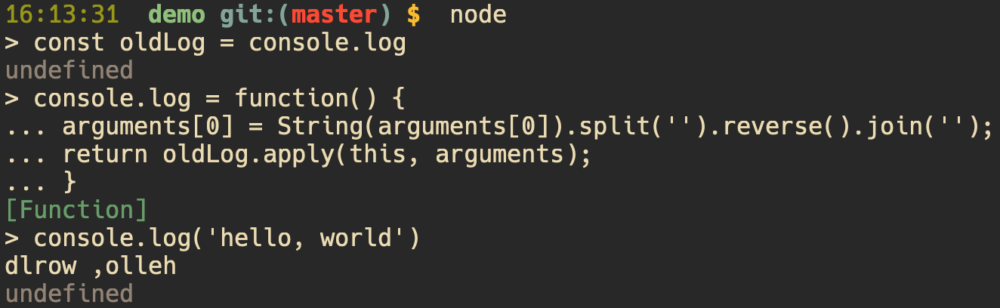

---

[.code-highlight: all]
[.code-highlight: 2]

```javascript
// demo.js
const express = require('express');
const app = express();

app.get('/hi', function(req, res) {
  const name = req.query.name;
  res.send('hello, ' + name);
});

app.listen(3000, function() {
	console.log('Example app listening on port 3000!');
});
```

^ let's look at a more useful example

^ here's that app I showed you a bit ago

^ it looks tiny but the top it's pulling in this library called express BUILD

^ apps like this that look small but really do a lot are kinda like icebergs

^ so we want to see what to see this iceberg actually looks like

---

[.code-highlight: all]

^ here's how you could do that

^ in node.js, each loaded file is treated as a 'module'

^ so we want to get access to the method responsible for compiling the files into these module objects

^ and so we monkey patch that to see what's going on

```javascript
// instrumentation/monkey.js
const Module = require('module');

const compile = Module.prototype._compile;
Module.prototype._compile = function(content, filename) {
	console.log(filename);
	const r = compile.apply(this, arguments);
	return r;
}
```

---

[.code-highlight: 2]
^ so, you require Module
it's one of the built-ins node gives you
it includes the definition for this module object that we're trying to patch


```javascript
// instrumentation/monkey.js
const Module = require('module');

const compile = Module.prototype._compile;
Module.prototype._compile = function(content, filename) {
	console.log(filename);
	const r = compile.apply(this, arguments);
	return r;
}
```

---

[.code-highlight: 4-9]
^  the rest is kinda the same as what i showed with console.log

^ [EXPLAIN]

^ log the filename, then call original function and return its result

```javascript
// instrumentation/monkey.js
const Module = require('module');

const compile = Module.prototype._compile;
Module.prototype._compile = function(content, filename) {
	console.log(filename);
	const r = compile.apply(this, arguments);
	return r;
}
```

---

```bash
$ node -r ../instrumentation/monkey.js demo.js
```

^ and here's what that looks like when we run it on our demo app

^ we run it with this new command

^ [explain -r flag]
tells node load this file before starting the app
that lets us start and do whatever it is we need to do before the app runs
and that way we don't miss anything

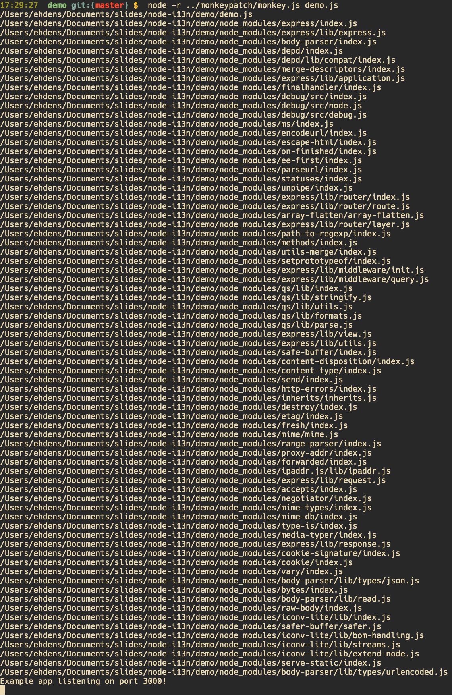

^ monkey patching itself is pretty simple in node, but you kinda need to know a bit before you do it


---

[.code-highlight: 4-9]
```javascript
// instrumentation/monkey.js
const Module = require('module');

const compile = Module.prototype._compile;
Module.prototype._compile = function(content, filename) {
	console.log(filename);
	const r = compile.apply(this, arguments);
	return r;
}
```
^ Half the work here is actually finding this compile function to patch

^ That's the part of this that I sorta pulled out of the oven pre-baked

^ But when you want to patch you may need to do a bit of research to figure out what you're patching

^ What arguments does it accept? What is it supposed to return?
because if you don't know these things ahead of time, you risk breaking the function
and javascript is more than happy to let you break the function

^ And so monkey patching kinda has to be a very deliberate thing to be of much use.

^ What if you wanted something much wider-reaching?

---

# AST Rewriting


^ You could start by rewriting the source code

---


## AST Rewriting


***MOVE ME***

Used for...

- React, TypeScript
- Minification
- Prettification
- Refactoring
- Code coverage

^ "kind of js but not quite" languages

---

## Abstract Syntax Trees

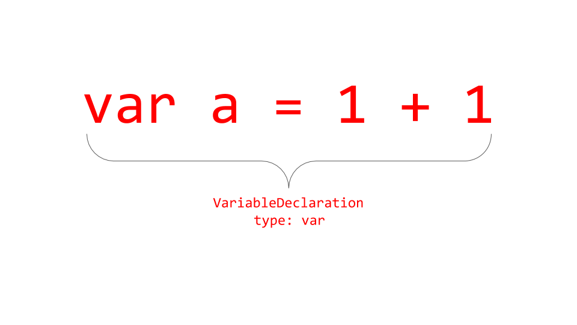

---

## Abstract Syntax Trees

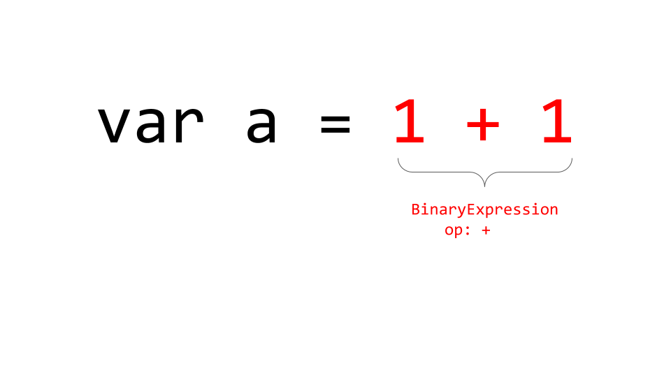

---

## Abstract Syntax Trees

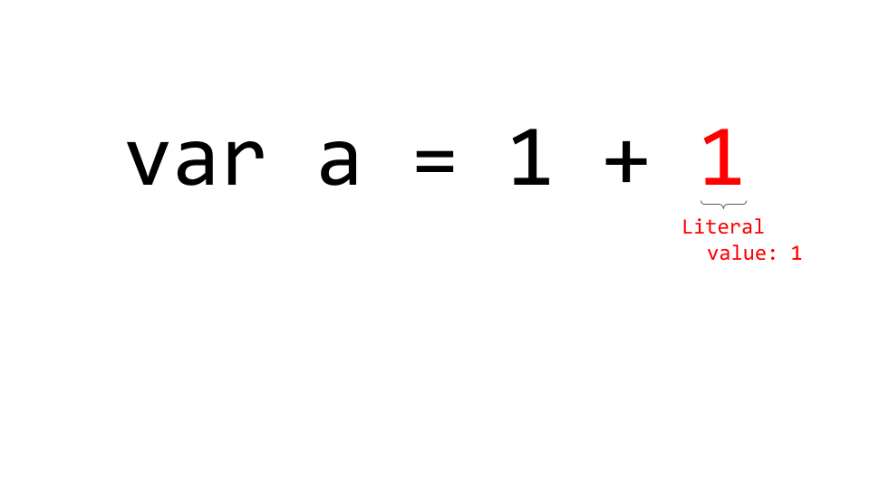

---

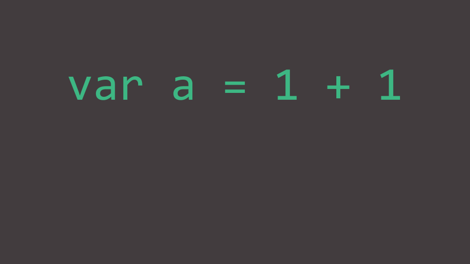

```json
{
    "type": "Program",
    "body": [
        {
            "type": "VariableDeclaration",
            "declarations": [
                {
                    "type": "VariableDeclarator",
                    "id": {
                        "type": "Identifier",
                        "name": "a"
                    },
                    "init": {
                        "type": "BinaryExpression",
                        "operator": "+",
                        "left": {
                            "type": "Literal",
                            "value": 1,
                            "raw": "1"
                        },
                        "right": {
                            "type": "Literal",
                            "value": 1,
                            "raw": "1"
                        }
                    }
                }
            ],
            "kind": "var"
        }
    ],
    "sourceType": "script"
}
```
^ (next slide will lag because of the size of the code snippet)

^ this is the full AST structure for that little blob

---

 ```json
{
    "type": "Program",
    "body": [
        {
            "type": "ExpressionStatement",
            "expression": {
                "type": "CallExpression",
                "callee": {
                    "type": "MemberExpression",
                    "computed": false,
                    "object": {
                        "type": "Identifier",
                        "name": "app"
                    },
                    "property": {
                        "type": "Identifier",
                        "name": "get"
                    }
                },
                "arguments": [
                    {
                        "type": "Literal",
                        "value": "/hi",
                        "raw": "'/hi'"
                    },
                    {
                        "type": "FunctionExpression",
                        "id": null,
                        "params": [
                            {
                                "type": "Identifier",
                                "name": "req"
                            },
                            {
                                "type": "Identifier",
                                "name": "res"
                            }
                        ],
                        "body": {
                            "type": "BlockStatement",
                            "body": [
                                {
                                    "type": "VariableDeclaration",
                                    "declarations": [
                                        {
                                            "type": "VariableDeclarator",
                                            "id": {
                                                "type": "Identifier",
                                                "name": "name"
                                            },
                                            "init": {
                                                "type": "MemberExpression",
                                                "computed": false,
                                                "object": {
                                                    "type": "MemberExpression",
                                                    "computed": false,
                                                    "object": {
                                                        "type": "Identifier",
                                                        "name": "req"
                                                    },
                                                    "property": {
                                                        "type": "Identifier",
                                                        "name": "query"
                                                    }
                                                },
                                                "property": {
                                                    "type": "Identifier",
                                                    "name": "name"
                                                }
                                            }
                                        }
                                    ],
                                    "kind": "const"
                                },
                                {
                                    "type": "ExpressionStatement",
                                    "expression": {
                                        "type": "CallExpression",
                                        "callee": {
                                            "type": "MemberExpression",
                                            "computed": false,
                                            "object": {
                                                "type": "Identifier",
                                                "name": "res"
                                            },
                                            "property": {
                                                "type": "Identifier",
                                                "name": "send"
                                            }
                                        },
                                        "arguments": [
                                            {
                                                "type": "BinaryExpression",
                                                "operator": "+",
                                                "left": {
                                                    "type": "Literal",
                                                    "value": "hello, ",
                                                    "raw": "'hello, '"
                                                },
                                                "right": {
                                                    "type": "CallExpression",
                                                    "callee": {
                                                        "type": "Identifier",
                                                        "name": "encodeURIComponent"
                                                    },
                                                    "arguments": [
                                                        {
                                                            "type": "Identifier",
                                                            "name": "name"
                                                        }
                                                    ]
                                                }
                                            }
                                        ]
                                    }
                                }
                            ]
                        },
                        "generator": false,
                        "expression": false,
                        "async": false
                    }
                ]
            }
        }
    ],
    "sourceType": "script"
}
```


^ and this is the AST for our little demo app

^ actually this isn't the entire app, this is just the 4 lines for responding to the request to '/hi'

---

# AST Rewriting

1. parse source code into AST
1. traverse tree, changing whatever you want
1. print the tree back out as source


^ Here's the high level for how we rewrite source code

^ every time a file is loaded, you build an abstract syntax tree, for it

^ you spider this tree, and change the nodes you care about

^ then you take this modified tree and turn it back into source code

^ we'll go through all of that again, step by step

^ in this next slide, i'm gonna show you all the code i wrote to parse a string of code into an abstract syntax tree

---

^ [WATER BREAK]

^ Right? Pretty crazy

^ I cannot stress enough how much you don't want to do this yourself

^ Things change too quickly, JavaScript syntax is kind of gross

^ there are some really really large open source projects with critical dependencies on being able to parse AST

^ it's not only rewriters that need to parse and traverse AST---also things like linters


```javascript
// Step 1: Parse code into AST
const ast = esprima.parse(code);
```

---

```javascript
// Step 2: Traverse the AST and change what we want
const after = estraverse.replace(before, {
	enter(node) {
		switch(node.type) {
			case 'FunctionDeclaration':
				const name = node.id && node.id.name || 'anonymous';
				const start = node.loc.start;
				const rel = path.relative(process.cwd(), filename);
				const loc = `${name} (${rel}:${start.line}:${start.column})`;

				node.body.type === 'BlockStatement' && node.body.body.unshift({
					'type': 'ExpressionStatement',
					'expression': {
						'type': 'CallExpression',
						'callee': {
							'type': 'MemberExpression',
							'computed': false,
							'object': {
								'type': 'Identifier',
								'name': 'console'
							},
							'property': {
								'type': 'Identifier',
								'name': 'log'
							}
						},
						'arguments': [
							{
								type: 'Literal',
								value: loc
							}
						]
					}
				});
			// ...
		}

		return node;
	}
});
```

---

```javascript
// Step 3: Print the new AST
return escodegen.generate(after);
```

---

## Monkey patch + AST rewrite

```javascript
// instrumentation/index.js
Module.prototype._compile = function(content, filename) {
	arguments[0] = rewrite(content, filename);
	const r = compile.apply(this, arguments);
	return r;
}
```

^ Let's put the two things we've seen so far together

^ Instead of just logging the file name, we replace the content argument with whatever our rewriter makes

---

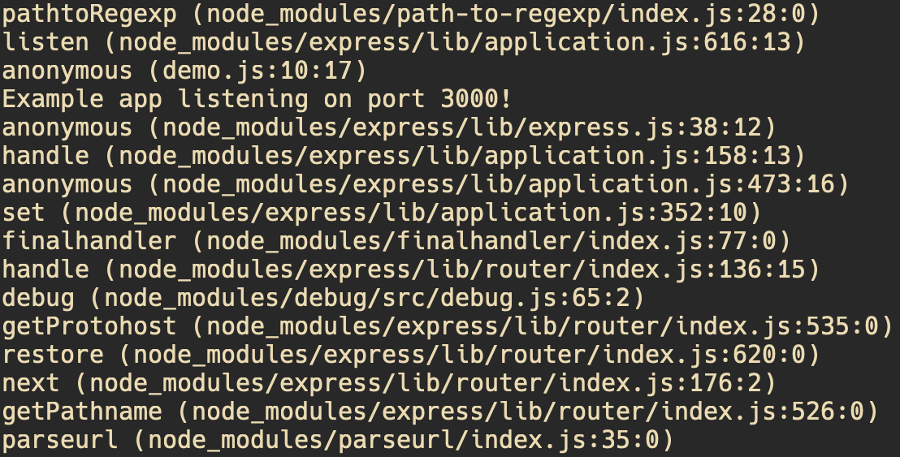

^ Now when we run the app with our instrumentation, our logs look like this

^ btw, I cropped the shit out of this, there's probably more than 2 thousand lines now

---

^ Go back to code and talk about how we can see most of what our code and library code is doing, but we're missing a few things

^ Let's look at this line 'req.input.name'---what do we do if we want to see that property access?

[.code-highlight: all]
[.code-highlight: 6]

```javascript
// demo.js
const express = require('express');
const app = express();

app.get('/hi', function(req, res) {
  const name = req.query.name;
  res.send('hello, ' + name);
});

app.listen(3000, function() {
	console.log('Example app listening on port 3000!');
});
```

---

# Proxy & Reflect

^ Object proxies are the last thing I'll talk about

^ They are really new to the language.

---

## Proxy

^ Object proxies are the last thing I'll talk about

^ They are really new to the language.

*Used to define custom behavior for fundamental operations (e.g. property lookup, assignment, enumeration, function invocation, etc).*[^1]

[^1]: [MDN](https://developer.mozilla.org/en-US/docs/Web/JavaScript/Reference/Global_Objects/Proxy)

^ In short, proxies wrap objects and allow you to define behavior for intercepting a bunch of the basic operations you'd perform on an object

---

## Terminology

**target**: the object being wrapped

**trap**: method providing intercept behavior for an operation

**handler**: object which holds traps

^ operations include setting, getting, and deleting properties, calling as a function, constructing, getting the prototype of, and so on

---

[.code-highlight: all]
[.code-highlight: 1]
[.code-highlight: 3-17]
[.code-highlight: 4-16]
[.code-highlight: 19]

^ here's an example of using a proxy to assimilate
[BUILD]

^ person is the target
[BUILD]

^ handler is... the handler
[BUILD]

^ and you can see that it holds a couple of methods, get and set. these are *traps* for getting and setting properties
[BUILD]

^ then we call new proxy, passing the target and handler
anything get or set to borg will invoke those traps we defined in the handler

```javascript
const person = new Person('Jean-Luc Picard');

const handler = {
	get(target, property, receiver) {
		if (property === 'name') {
			return 'Locutus of Borg';
		}

		return Reflect.get(...arguments);
	},

	set(target, property, value, receiver) {
		// Don't actually set.
		console.log('Resistance is futile.');
		return true;
	}
};

const borg = new Proxy(person, handler);
```

---

# Proxy stuff I should mention

Proxies are pretty new and you don't see them in many places yet, but they've got a ton of potential for use in instrumentation and security

Interesting patterns to mention:

- Recursive proxies, eg membranes. Link to whitepaper
- Proxies on empty object. Can be used to create mocks for testing
- You can also 'protect' objects that'll be consumed by code which isn't yours:
  Revokable proxies, 'honeypots' where you let them set and get from a dummy object but gets to actual properties on the real object return the real values

---

[.autoscale: true]

# Image Credits

- Contrast Security: [https://www.contrastsecurity.com](https://www.contrastsecurity.com)
- Node.js Foundation: [https://nodejs.org/en/about/resources/](https://nodejs.org/en/about/resources/)
- [Slate](http://www.slate.com/articles/health_and_science/science/2017/06/the_mayor_of_redondo_beach_california_never_killed_a_tree_named_clyde.html)

---

TODO TODO

Make sure my comments in code point to the correct files

- If this slide is confusing to you, just look in the upper right, we're all going to die
- Needs to have an operating time that is less than the heat death of the universe
- Can include promisify and deprecate for monkey patch example

---

```bash
$ node demo.js
Example app listening on port 3000!
```


^ if you set name to <script>alert(0)</script>

^ then it looks like this and that's unfortunate

^ and as i mentioned, all the code from this will be up on my github---don't use this blob, it's not good

